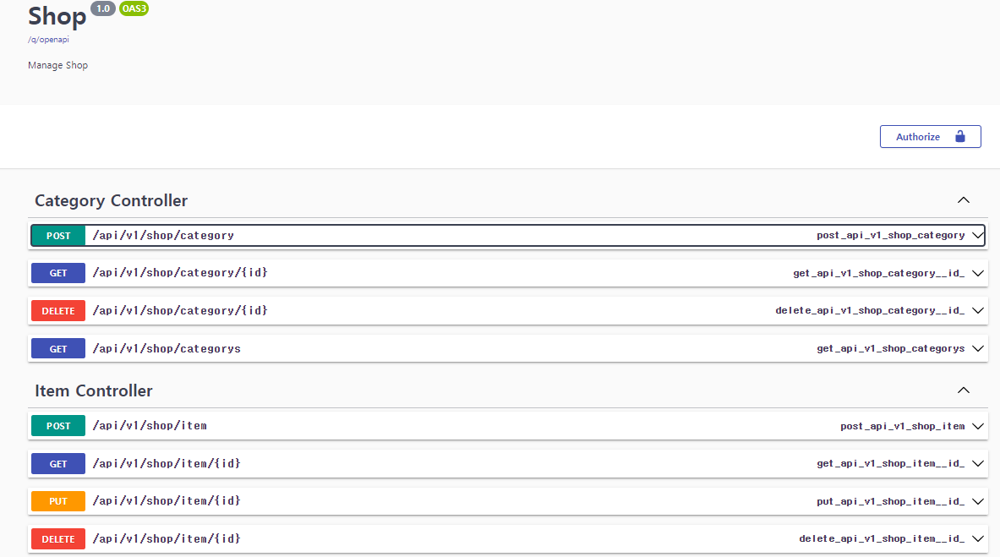

# shop (작성 중...)

> Import API list

```
    [framework]
    quarkus-resteasy-reactive
    quarkus-arc(CDI dependency injection)
    
    [docs]
    quarkus-smallrye-openapi

    [db]
    quarkus-hibernate-reactive-panache
    quarkus-reactive-pg-client
    spring-boot-starter-data-redis

    [test]
    quarkus-junit5

```

> Project Map

```
- seq
  + common                  … exception/auth 
    + exception             … custom exception handler 
  + config                  … config(cors/jpa/profile/security/swagger)
  + data                    … data
    + dao                   … database access layer
    + dto                   … layer간 data 전송 객체
    + entity                … database table
    + repository            … PanacheRepository
  + service                 … service layer
  + web                     … presentation layer
  ```


> Reactive web 
  
  - 원본 https://github.com/jaemocho/seq shop 부분을 반응형 웹으로 refactoring

  
> API Test (swagger)

 - application 기동 후 아래 page 접속 
 - http://localhost:8080/swagger-ui/index.html#/ 
    


> 기본 안내 사항 

This project uses Quarkus, the Supersonic Subatomic Java Framework.

If you want to learn more about Quarkus, please visit its website: https://quarkus.io/ .

## Running the application in dev mode

You can run your application in dev mode that enables live coding using:
```shell script
./mvnw compile quarkus:dev
```

> **_NOTE:_**  Quarkus now ships with a Dev UI, which is available in dev mode only at http://localhost:8080/q/dev/.

## Packaging and running the application

The application can be packaged using:
```shell script
./mvnw package
```
It produces the `quarkus-run.jar` file in the `target/quarkus-app/` directory.
Be aware that it’s not an _über-jar_ as the dependencies are copied into the `target/quarkus-app/lib/` directory.

The application is now runnable using `java -jar target/quarkus-app/quarkus-run.jar`.

If you want to build an _über-jar_, execute the following command:
```shell script
./mvnw package -Dquarkus.package.type=uber-jar
```

The application, packaged as an _über-jar_, is now runnable using `java -jar target/*-runner.jar`.

## Creating a native executable

You can create a native executable using: 
```shell script
./mvnw package -Pnative
```

Or, if you don't have GraalVM installed, you can run the native executable build in a container using: 
```shell script
./mvnw package -Pnative -Dquarkus.native.container-build=true
```

You can then execute your native executable with: `./target/shop-1.0.0-SNAPSHOT-runner`

If you want to learn more about building native executables, please consult https://quarkus.io/guides/maven-tooling.

## Provided Code

### RESTEasy Reactive

Easily start your Reactive RESTful Web Services

[Related guide section...](https://quarkus.io/guides/getting-started-reactive#reactive-jax-rs-resources)
